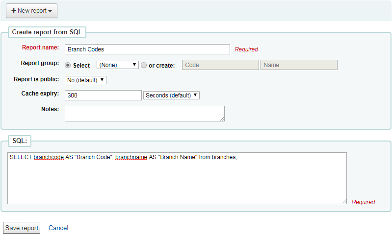
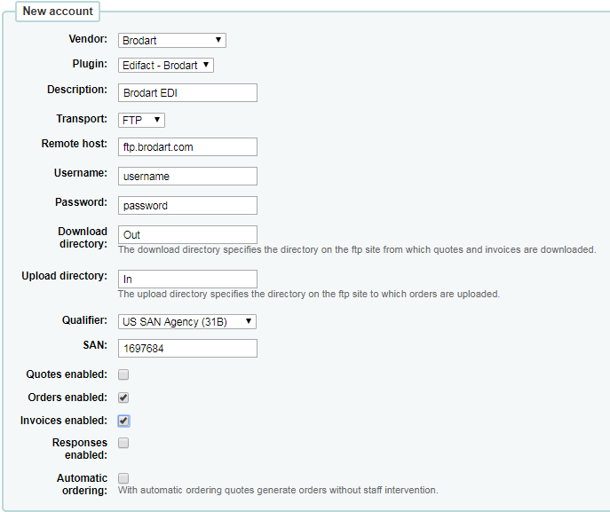
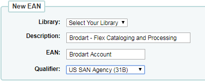
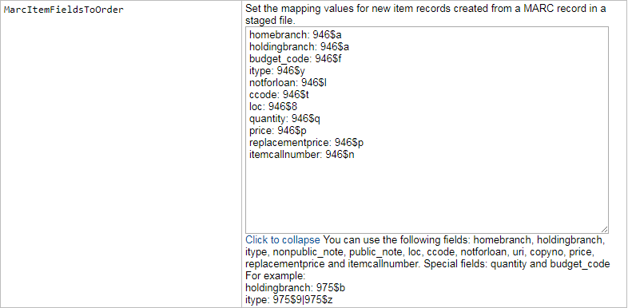
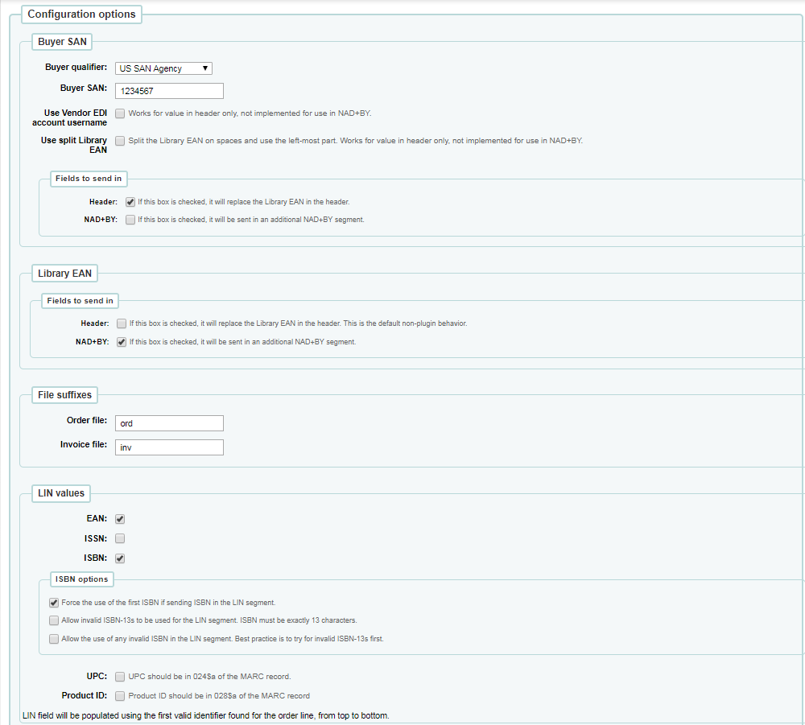
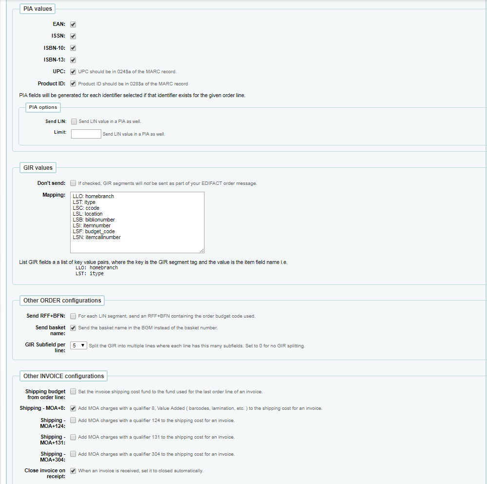

= Brodart EDI setup for Koha
John Sommers, Kyle M Hall
:toc:
:icons: font
:source-highlighter: rouge
:title-logo-image: cover.png

{docdate}

John Sommers <John.Sommers@brodart.com> +
Kyle Hall <kyle@bywatersolutions.com> +

The latest version of this document is available as https://github.com/bywatersolutions/koha-plugin-edifact-enhanced/blob/brodart/INSTALLATION/INSTALLATION.pdf[PDF] and https://github.com/bywatersolutions/koha-plugin-edifact-enhanced/blob/brodart/INSTALLATION/INSTALLATION.adoc[on the web].

== Send Koha codes to Brodart

* Select _Reports_ from the _More_ drop-down menu in Koha
* Click _Create from SQL_ in the _Guided Reports_ section of the _Reports_ page
* Enter _Report Name_ and _Select statement_ for each of the reports listed below
* Save and run each report
* Download results in _comma separated text_ format and attach to email to your customer care associate at Brodart Company

.Example report

* Report Name: *Branch Codes*
** `+SELECT branchcode AS "Branch Code", branchname AS "Branch Name" from branches;+`
* Report Name: *Collection Codes
*
** `+SELECT authorised_value AS "Collection Code", lib AS "Collection Name" FROM authorised_values WHERE category = 'CCODE';+`
* Report Name: *Shelving Location Codes*
** `+SELECT authorised_value AS "Shelving Location Code", lib AS "Shelving Location Name" FROM authorised_values WHERE category = 'LOC';+`
* Report Name: *Item Type Codes*
** `+SELECT itemtype AS "Item Type Code", description AS "Item Type Name" FROM itemtypes;+`
* Report Name: *Fund Codes*
** `+SELECT budget_code AS "Fund Code", budget_name AS "Fund Name" FROM aqbudgets GROUP BY budget_code ORDER BY timestamp DESC;+`

== Install the Brodart EDI plugin for Koha

* Open the link https://github.com/bywatersolutions/koha-plugin-edifact-enhanced/releases in a web browser.
* Locate most recent _koha-plugin-edifact-enhanced-brodart_ plugin
* Click the _kpz_ file to Download
* In Koha, Select _Administration_ from the _More_ drop-down menu
* Click _Manage plugins_ in the Plugins section of the Administration Page
* Click the _Upload plugin_ button
* Click the _Choose File_ button
* Select the plugin file you just downloaded and click the _Open_ button.
* Click the _Upload_ button
* You should now see a new plugin named _Edifact - Brodart_

== Create a Brodart Vendor Record

* Select _Administration_ from the _More_ drop-down menu in Koha
* Click _EDI accounts_ in the Acquisition parameters section of the Administration page
* Click the _New Account_ button
* Select _Brodart_ as the Vendor
* Select _Edifact – Brodart_ as the Plugin
* Select _FTP_ as the Transport
* Enter _ftp.brodart.com_ as the Remote host
* Enter the _username_ and _password_ from the Brodart EDI Order Information sheet
* Enter _Out_ as the Download directory
* Enter _In_ as the Upload directory
* Select _US SAN Agency (31B)_ as the Qualifier
* Enter _1697684_ as the SAN ( Brodart's _Standard Address Number_ )
* Check _Order enabled_
* Check _Invoices enabled_

.EDI vendor record creation form

== Create Brodart Account Records (EANs)


Create an EAN for each unique Brodart account number on the attached EDI Order Information sheet.  “Spec codes” are to be entered as the first character of the basket name, sent as the purchase order number, to further define processing.

* Select _Administration_ from the _More_ drop-down menu in Koha
* Click _Library EANs_ in the Acquisition parameters section of the Administration page
* Click the _New EAN_ button
* Select _Brodart_ as the Vendor
* Select your library from the library pulldown
* Enter a “Brodart account number” from the Brodart EDI Order Information sheet
* Select _US SAN Agency (31B)_ as the Qualifier

.Library EAN creation form

== Create MARC Record Import Map

* Select “Administration” from the “More” drop-down menu in Koha
* Click “Global system preferences” on the Administration page
* Click the “Click to Edit” hyperlink in the field to the right of “MarcItemFieldsToOrder”
* Enter the following information into the data entry box
+
....
homebranch: 946$a

holdingbranch: 946$a

budget_code: 946$f
itype: 946$y

notforloan: 946$l
ccode: 946$t
loc: 946$8
quantity: 946$q
price: 946$p
replacementprice: 946$p
itemcallnumber: 946$n
notforloan: 946$7
....
* Click “Save all Acquisitions preferences” button

.Koha system preference *MarcItemFieldsToOrder*

== Configure EDI plugin

* Browse to Administration => Manage Plugins
* Click the “Actions” button on the row for the “Edifact - Brodart” plugin, select the “Configure” option.
* Enter the following data into the plugin `Configuration options`:
** Buyer SAN
*** Buyer qualifier: US SAN Agency
*** Buyer SAN: Enter the buyer SAN Brodart has provided you
*** Fields to send in
**** Header: checked
** Library EAN
*** NAD+BY: checked
** File suffixes
*** Order file: ord
*** Invoice file: inv
** LIN values:
*** EAN: checked
*** ISBN: checked
** ISBN options
*** Force the user of the first ISBN if sending ISBN in the LIN segment: checked
** PIA values
*** EAN: checked
*** ISSN: checked
*** ISBN-10: checked
*** ISBN-13: checked
*** UPC: checked
*** Product ID: checked
** GIR values:
*** Mapping
+
....
LLO: homebranch
LST: itype

LSC: ccode

LSL: location
LSB: biblionumber

LSI: itemnumber

LSF: budget_code
LSN: itemcallnumber
....
** Other ORDER configurations
*** Send basket name: checked
** Other INVOICE configurations
*** Shipping budget from order line: checked
*** Shipping - MOA+8: checked
*** Close invoice on receipt: checked _(optional)_
*** Add item note receipt: checked _(optional)_
* Click _Save Configuration_ button.

.Plugin configuration, 1 of 2

.Plugin configuration, 2 of 2

== Bibz to Koha and EDI Release Workflow

* Download the On Order records from Bibz
* In Koha, ensure the system preference _AcqCreateItem_ option set to _placing an order_
* Create the basket in Koha
* Stage on order records in Koha
* Add records from staged file to basket
* Save the imported records and double check the basket totals match the cart in Brodart
* Submit EDI order from Koha
* Delete the cart from Brodart’s site.
 
